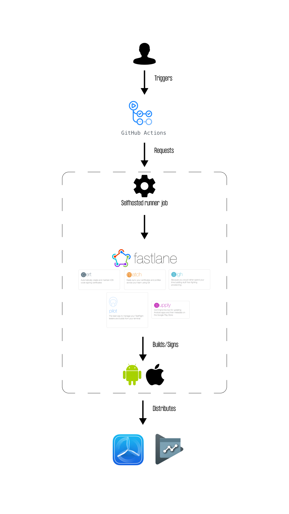

# Flutter CICD - Let's deliver app using Fastlane and Github selfhosted runner

## About
This project shows how to create a minimal configuration for building, signing and the Flutter app's delivery on your local machine. Everything is done automatically and invoked by repository's event (PR, commit, manual run). There are different flavors available.

Using your local machine means you don't pay for cloud services and resources but also has limitations.

## Tools 
- [Fastlane](https://fastlane.tools)
- [Github Actions](https://docs.github.com/en/actions)
- [Github Selfhosted runner](https://docs.github.com/en/actions/hosting-your-own-runners/about-self-hosted-runners)

## Requirements
- Local machine (macOS - M1 in my case)
- Github/Google Play/Apple Developer account

You can create a flow without signing the app, then you don't need Apple/Google 's account.

## How to use

The main branch is the final result. You can just checkout, change secrets, link your accounts and you are clear to go.

To see implementation step-by-step check branches.

## Step by step
1.  Hello. [doc](/docs/0-hello.md) [branch](https://github.com/codigee-devs/self-hosted-flutter-ci-cd-with-fastlane/tree/0-Hello!)
2.  API Keys and ENV variables. [doc](/docs/1-api-keys-and-env-variables.md) [branch](https://github.com/codigee-devs/self-hosted-flutter-ci-cd-with-fastlane/tree/1-api-keys-and-env-variables)
3. Flavors and build settings [doc](/docs/2-flavors-and-build-settings.md) [branch](https://github.com/codigee-devs/self-hosted-flutter-ci-cd-with-fastlane/tree/2-flavors-build-settings)
4. Fastlane [doc](/docs/3-fastlane.md) [branch](https://github.com/codigee-devs/self-hosted-flutter-ci-cd-with-fastlane/tree/3-fastlane)
5. Github workflows and scripts [docs](/docs/4-github-workflows-scripts.md) [branch](https://github.com/codigee-devs/self-hosted-flutter-ci-cd-with-fastlane/tree/4-github-workflows/fastlane)
6. Github Selfhosted runner [docs](/docs/5-github-selfhosted-runner.md) [branch](https://github.com/codigee-devs/self-hosted-flutter-ci-cd-with-fastlane/tree/5-github-selfhosted-runner)

## Flow

